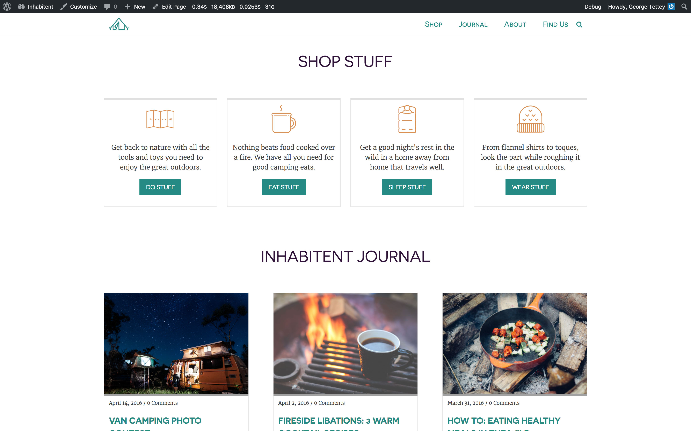

#Inhabitent project

- Create a multi-page website with a blog for a camping supply company called Inhabitent Camping Supply Co. using WordPress as a content management system.

##Technologies Used

- git
- gulp
- google chrome
- chrome developer tools
- HTML validator
- CSS validator
- Font Squirrel
- Jquery
- Wordpress
- Contact Form 7 
- Custom Field Suite
- Theme Check plugin
- WP Migrate DB

##Personal Learnings

- how to manage content using a CMS like wordpress.
- how to build/edit a wordpress theme.
